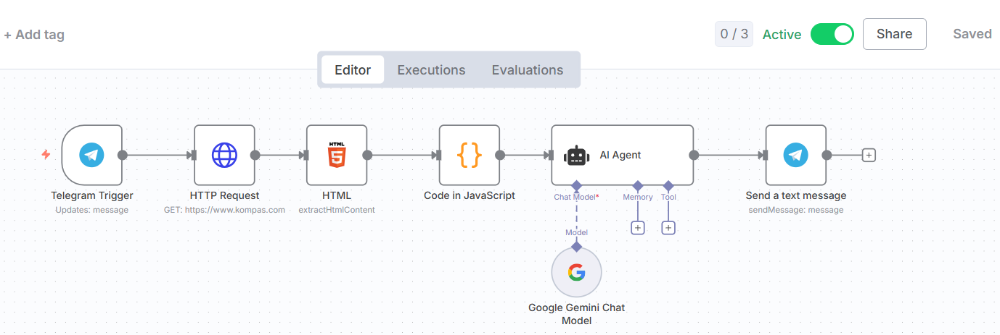
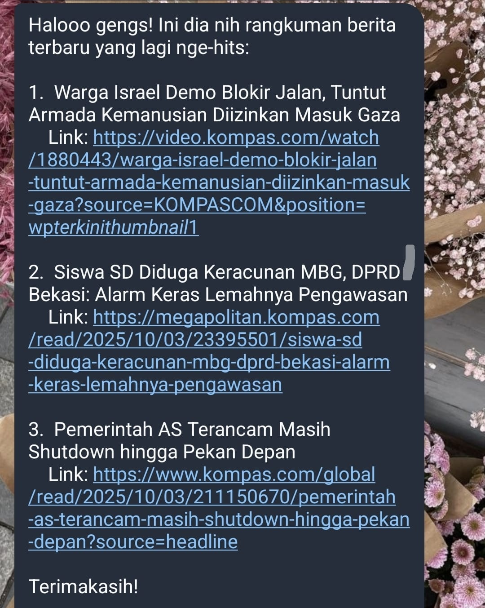

# ECC-NIN-ChatAgent-Jihan-Afifah-Mirzani-9

## ⚡ InfoKilat – 🤖 Telegram News Bot
Proyek Infokilat adalah implementasi chatbot di platform Telegram yang berfungsi sebagai asisten berita otomatis. Bot ini menggunakan n8n sebagai workflow engine untuk mengambil data berita dari Kompas dan Google Gemini (melalui AI Agent) untuk menyaring 3 berita terpopuler/terbaru secara general, yang kemudian disajikan dengan gaya bahasa gaul yang unik dan ramah.

Workflow n8n ini dibuat untuk **mendeteksi dan mengekstraksi nilai tertentu dari dokumen** (misalnya: `judul` dan link dari berita terpopuler, highlight, dan terkini lainnya).

## 📊 Data yang Ditampilkan
Setiap entri berita dalam output akhir (Telegram) akan menampilkan dua elemen penting dari Kompas:
- Judul Berita (Dari berita terpopuler/terbaru)
- Link Berita (Link langsung ke laman berita)

## 💡 Alur Kerja Workflow

### 1. **Telegram Trigger**
- Fungsi: Memulai workflow.
- Aksi: Aktif setiap kali pengguna mengirim pesan teks ke Telegram Bot.
- Input: Pesan dari pengguna (misalnya /start atau teks apa pun).

### 2. **Get Data: HTTP Request**
- Fungsi: Mengumpulkan data mentah.
- Aksi: Node ini memanggil API eksternal (sumber data Kompas) untuk mengambil feed berita umum dalam format JSON.
- Output: Data mentah dikirim ke node selanjutnya.

### 3. **Ekstraksi Data: HTML**
- Fungsi: Menyaring Judul dan Link dari HTML mentah.
- Aksi: Menggunakan CSS Selector untuk:
  1. Ekstraksi Judul berita (h2.mostTitle, div.spotlightItem h2.spotlightTitle, ...)
  2. Ekstraksi Link berita (Mengambil atribut href dari tag a[data-index])

### 4. **Pre-Processing: Code in JavaScript**
- Fungsi: Memasangkan Judul dan Link serta menyaring data.
- Aksi: Kode JavaScript melakukan tugas kompleks:
  1. Pencocokan Data: Mencocokkan judul berita dengan link yang paling sesuai (dengan membandingkan kata-kata dalam judul dengan URL).
  2. Random & Slice: Mengambil 3 item teratas (top3Berita) dari array data yang sudah dicocokkan.
  3. Output: Menyediakan array final (beritaLengkap) yang berisi judul dan link untuk Gemini.

### 5. **AI Agent (Gemini)**
- Fungsi: Penyaringan otomatis dan Format Output.
- Aksi: Gemini menerima array 'beritaLengkap' dari node sebelumnya. Berdasarkan System Prompt (sebagai asisten berita gaul), Gemini melakukan:
  1. Pemilihan: Menyaring 3 berita terbaru/terpopuler dari data yang diterima.
  2. Format: Mengolah output ke dalam format bullet point rapi dengan gaya bahasa gaul.
 
### 6. **Respond: Send a text message**
- Fungsi: Mengirim hasil akhir.
- Aksi: Hasil teks yang telah diolah oleh Gemini dikirim balik ke pengguna melalui Telegram Bot.
---

## ✅ KESIMPULAN
Saya membangun workflow Infokilat ini dengan satu tujuan sederhana: mengubah feed berita umum Kompas menjadi ringkasan yang fokus pada 3 berita highlight yang disajikan dengan persona unik. Ini adalah bot yang saya rancang untuk memberikan update berita yang paling efisien dan ramah, terutama bagi Anda yang hanya ingin tahu intinya saja.

---

## 🖼️ Contoh Output (Infokilat di Telegram)

